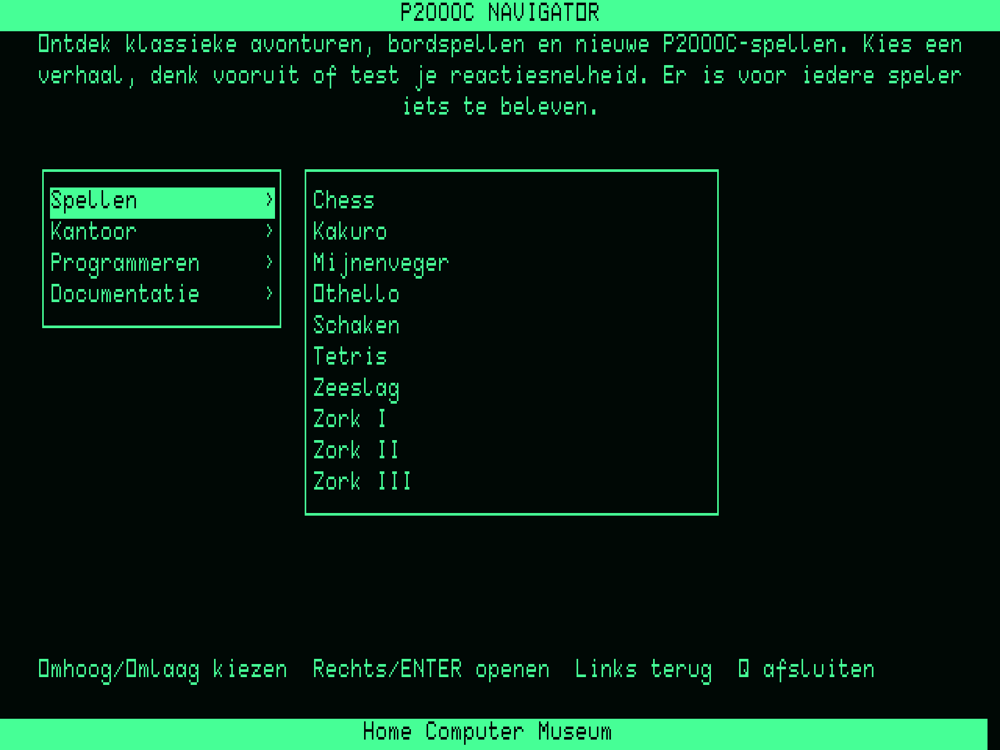
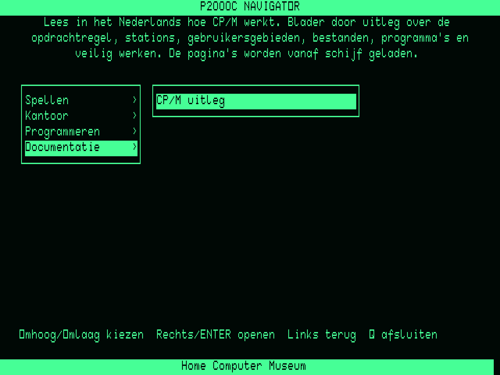
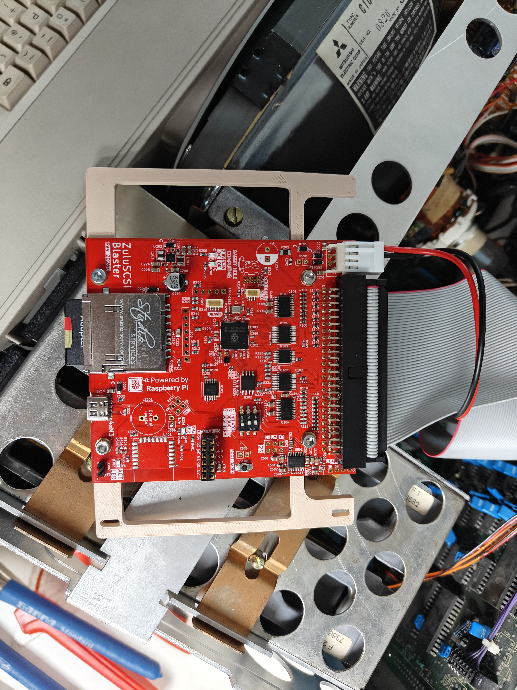
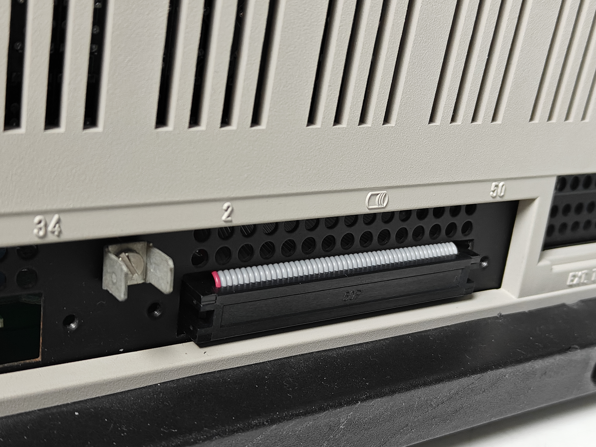
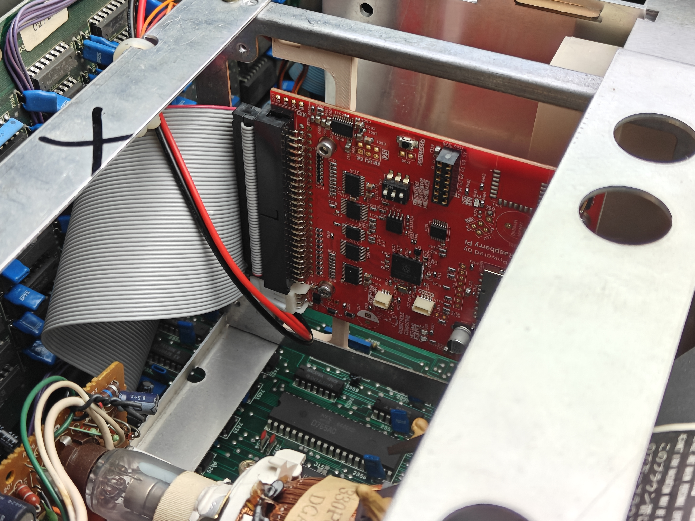
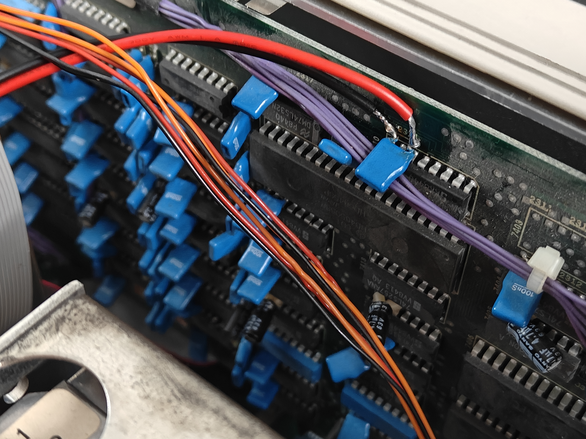
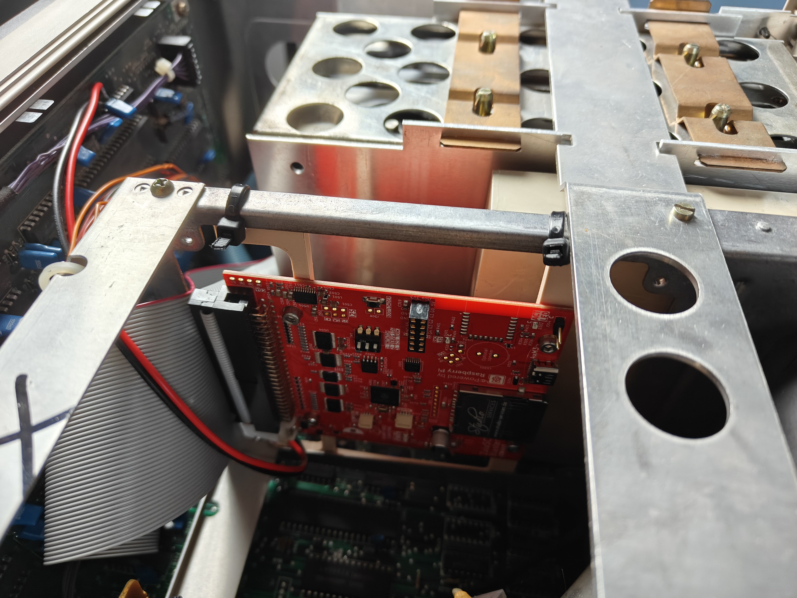

# P2000C ZuluBlaster

[](https://github.com/ifilot/p2000c-zulublaster-sasi-drive/actions/workflows/build.yml)
[](https://github.com/ifilot/p2000c-zulublaster-sasi-drive/releases/latest)
[](LICENSE)

This repository contains the source code to create hard drive images for the
[Zulublaster SASI drive emulator]() for the Philips P2000C. Several versions of
the drive images exists, either with or without a launch menu (mainly catering
to the [Home Computer Museum in Helmond]()) and with support for a RAM drive
when the P2000C comes equiped with the 8088 CoPower board.

For a live demonstration, have a look at the [WebAssembly
emulator](https://ifilot.github.io/p2000c-zulublaster-sasi-drive/).

See [CHANGELOG.md](CHANGELOG.md) for the changes included in each semantic version.

## P2000C Navigator

The optional Navigator provides a Dutch text-mode interface with categories,
program descriptions, keyboard navigation and automatic return after programs
exit. The screenshots use the P2000C character ROM and terminal attributes.
Click either image for the full-size 80-column display.

| Category overview | Selected application |
| --- | --- |
| [](docs/screenshots/navigator-overview.png) | [](docs/screenshots/navigator-cpm-guide.png) |

The ZuluBlaster used for this project came from
[Studio Services](https://studio-services.de/produkt/zuluscsi-blaster-rp2350b),
which is a good EU option. Check for a suitable local vendor as well.

## Downloads

Choose one package from the
[latest tagged release](https://github.com/ifilot/p2000c-zulublaster-sasi-drive/releases/latest):

| Package | Startup | CoPower RAM disk |
| --- | --- | --- |
| [**Download CP/M**](https://github.com/ifilot/p2000c-zulublaster-sasi-drive/releases/latest/download/p2000c-zulublaster-v1.2.3-pro.zip) | CP/M prompt | No |
| [**Download CP/M + CoPower**](https://github.com/ifilot/p2000c-zulublaster-sasi-drive/releases/latest/download/p2000c-zulublaster-v1.2.3-pro-coboard.zip) | CP/M prompt | G: |
| [**Download Navigator**](https://github.com/ifilot/p2000c-zulublaster-sasi-drive/releases/latest/download/p2000c-zulublaster-v1.2.3-menu.zip) | P2000C Navigator | No |
| [**Download Navigator + CoPower**](https://github.com/ifilot/p2000c-zulublaster-sasi-drive/releases/latest/download/p2000c-zulublaster-v1.2.3-menu-coboard.zip) | P2000C Navigator | G: |

Each ZIP contains one complete, tested SD-card setup. Extract its contents
directly to the root of a FAT32 SD card. Advanced users can also download the
[standalone tools](https://github.com/ifilot/p2000c-zulublaster-sasi-drive/releases/latest/download/p2000c-zulublaster-v1.2.3-tools.zip)
and [SHA-256 checksums](https://github.com/ifilot/p2000c-zulublaster-sasi-drive/releases/latest/download/SHA256SUMS.txt).

## Hardware installation

1. Switch off and unplug the P2000C before opening it.

2. Print the supplied [bracket](assets/hardware/zulublasterbracket.stl). The
   tested print uses PLA, 15% infill, a 0.4 mm nozzle and 0.2 mm layers. Attach
   the ZuluBlaster with four M3 × 8 mm screws; M3 × 6 mm screws also fit.

   

3. Make a custom 50-pin ribbon cable from the rear card-edge connector to the
   ZuluBlaster. Fit and secure either the card-edge connector or IDC connector
   first, leaving the other end loose. Feed that loose end through the small
   rear opening, then fit and secure the second connector. Check connector
   orientation before crimping.

   

   

4. Connect a power lead as well. The tested lead starts as a standard floppy
   Molex cable: remove the yellow 12 V wire and one black GND wire, retaining
   the red 5 V wire and the other black GND wire. Insulate the removed wires,
   strip the retained ends and solder them to the blue 100 nF decoupling
   capacitor shown below. The ZuluBlaster draws little power, so this is a
   practical tap point. Verify 5 V and polarity at the connector and again at
   the ZuluBlaster before switching on. Measure twice: the P2000C has a fuse,
   but it is better not to test it on a venerable machine.

   

5. Place the bracket beneath the chassis crossbar and tidy the cables. Its
   dimensions let it snap onto the chassis; for additional security, fasten it
   with two zip ties as shown. Before closing the machine, perform one final
   check of the ribbon-cable orientation and power polarity. Then close it and
   power it on.

   

## Software installation

> [!WARNING]
> **Enable the ZuluBlaster's TERMINATION (TERM) DIP switch before booting.**
> The P2000C SASI setup described here requires termination enabled. With it
> disabled, the SD card and disk images can be detected normally by the
> ZuluBlaster while the P2000C fails to boot from SASI. Power off before changing
> the switch; after powering on, confirm the log reports termination enabled
> (`termination 1`). This is a hardware switch, not a `zuluscsi.ini` setting.

Before preparing the card, update the ZuluBlaster to the latest firmware. Download
the universal ZIP from the [ZuluSCSI firmware releases](https://github.com/ZuluSCSI/ZuluSCSI-firmware/releases),
copy it unchanged to the root of a FAT32-formatted SD card, insert it and power
the ZuluBlaster. The activity LED flashes rapidly during the brief update; the
board removes the update file after success. See the official
[firmware instructions](https://github.com/ZuluSCSI/ZuluSCSI-firmware#programming--bootloader).

Use a high-quality SD card. SanDisk cards have worked reliably in this setup;
low-end cards produced poor results. This matters as much as the image files.

From this checkout, install Python 3.11+, Make and `z80asm`, then choose:

```console
make pro
```

To try CP/M on your computer first, use `make run`
([emulator setup](docs/building.md#preview-without-hardware)).

Copy **HD0_256.hda**, **HD1_256.hda** and **zuluscsi.ini** from `dist/pro/` to
the root of a FAT32 SD card. Use all three files from the
same build. Back up an existing card before replacing its images, eject it
cleanly, insert it into the ZuluBlaster and boot the P2000C.

The supplied `zuluscsi.ini` contains the P2000C SASI settings: 256-byte blocks,
selection latch and LUN-to-ID mapping enabled; parity, SCSI-2 and unit attention
disabled. Do not replace it with a generic ZuluSCSI configuration.

**A:** system and development tools · **B:/C:** floppies · **D:** applications
in documented CP/M user areas · **E:** spare · **F:** games. Run `D:CPMHELP`
from user 0 for the Dutch, multi-page CP/M introduction. The system opens the
CP/M prompt. See
[Aan de slag met CP/M](docs/cpm.md) for everyday commands and what to do if a
program gets stuck.

SuperCalc in D: user 3 is a minimal, preconfigured P2000C installation:
`SC2.COM`, `SC2.OVL` and `SC2.HLP` only. Installers, unrelated utilities and
sample worksheets are excluded; the old bundled `GRAFIEK.CAL` fails to load
and appears damaged. Start with a new worksheet. This cleanup does not
establish the cause of the reported SD-image boot failure.

Edit [distribution.json](distribution.json) to select software. Add
`make pro-coboard` to build for G: RAM using the bundled combined boot system. The RAM
disk is confirmed working on physical hardware.
See the [documentation](docs/README.md) for configuration, CoPower status and
diagnostics.

## Licensing

The project-owned build tools, Navigator source, assembly utilities, web
interface, tests and documentation are available under the
[GNU GPL v3 or later](LICENSE).
The bundled emulator retains its upstream GPLv3 license, while its third-party
CPU cores retain their MIT and ISC notices. Historical CP/M binaries, firmware
and other third-party assets remain the property of their respective owners and
are not relicensed by this repository; see the [software provenance notes](docs/technical/software-sources.md).

## References

- The [StarDot P2000C SASI discussion](https://stardot.org.uk/forums/viewtopic.php?start=30&t=10374)
  was important inspiration. This project uses a different, more robust
  packaged-image approach.
- The [ZuluSCSI P2000C discussion](https://github.com/ZuluSCSI/ZuluSCSI-firmware/issues/903#issuecomment-5195147179)
  records the configuration work behind the supplied `zuluscsi.ini`.
